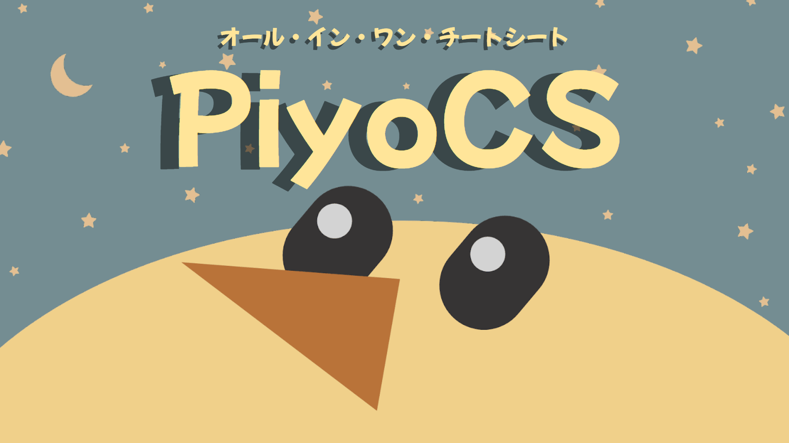

# PiyoCS

### オール・イン・ワン・チートシート

>プログラミングの簡易的な書き方をまとめたサイトになります。  

リンク: [https://s20016.github.io/PiyoCS/PiyoCS](https://s20016.github.io/PiyoCS/) 

**今入っている言語**
- Python
- Java
- JavaScript
- Kotlin

**2年生の課題研究**  
チームメンバー  
[s20016](https://github.com/s20016)
[s20022](https://github.com/s20022)
[s20024](https://github.com/s20024)  